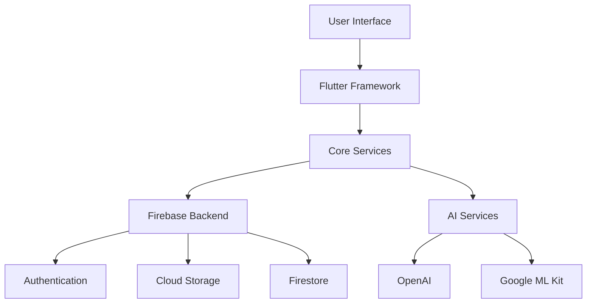

<div align="center">

# OneAI 🤖


### One Click, One Solution.

[](https://flutter.dev)
[](https://firebase.google.com)
[](https://openai.com)

</div>

## 🌟 Overview

OneAI is a cutting-edge Flutter application that brings the power of artificial intelligence to your fingertips. With its sleek interface and comprehensive features, OneAI transforms how you interact with AI technology in your daily life.

<div align="center">
<table>
<tr>
<td>

</td>
<td>

</td>
<td>

</td>
</tr>
</table>
</div>

## ✨ Features

### 🎯 Core AI Capabilities

#### Text Processing
- Advanced text generation and completion powered by state-of-the-art language models
- Natural language understanding with context-aware responses
- Real-time text analysis for sentiment and intent
- Comprehensive multi-language support for global accessibility

#### Image Intelligence
- Seamless image-to-text conversion with high accuracy
- Advanced OCR capabilities for document digitization
- Quick QR and barcode scanning functionality
- Intelligent text extraction from complex images

<div align="center">
<table>
<tr>
<td>

</td>
<td>

</td>
</tr>
</table>
</div>

### 🎨 User Experience

- **Modern Design**
  - Stunning Glassmorphism UI elements
  - Fluid animations and micro-interactions
  - Responsive layout adapting to all screen sizes
  - Thoughtfully crafted Dark/Light themes

- **Typography**
  - Custom font integration:
    - Poppins for headlines
    - RobotoMono for code blocks
    - HindSiliguri for multilingual support

### 🛠️ Technical Architecture



## 🚀 Getting Started

### Prerequisites

```yaml
dependencies:
  flutter: ">=3.3.0 <4.0.0"
  dart: ">=3.0.0 <4.0.0"
```

### Quick Start

1. **Clone & Install**
```bash
git clone https://github.com/Noctambulist007/OneAI.git
cd one_ai
flutter pub get
```

2. **Configure Environment**
```bash
# Create .env file
cp .env.example .env

# Add your API keys
OPENAI_API_KEY=your_key_here
FIREBASE_API_KEY=your_key_here
```

3. **Run the App**
```bash
flutter run
```

## 📦 Core Dependencies

### AI & ML
```yaml
google_generative_ai: ^0.4.3
google_mlkit_text_recognition: ^0.14.0
dart_openai: ^5.1.0
```

### UI/UX
```yaml
animate_do: ^3.3.4
glassmorphism: ^3.0.0
lottie: ^3.1.0
rive: ^0.13.0
flutter_svg: ^2.0.17
```

### Backend
```yaml
firebase_core: ^3.1.1
firebase_auth: ^5.1.1
cloud_firestore: ^5.0.2
sqflite: ^2.3.2
```

## 🤝 Contributing

We welcome contributions! Here's how you can help:

1. Fork the repository
2. Create your feature branch (`git checkout -b feature/AmazingFeature`)
3. Commit your changes (`git commit -m 'Add AmazingFeature'`)
4. Push to the branch (`git push origin feature/AmazingFeature`)
5. Open a Pull Request

## 📄 License

This project is licensed under the MIT License - see the [LICENSE](LICENSE) file for details.

<div align="center">

## 💖 Support

If you find OneAI helpful, please consider giving it a star ⭐️

Made with ❤️ using Flutter

</div>
