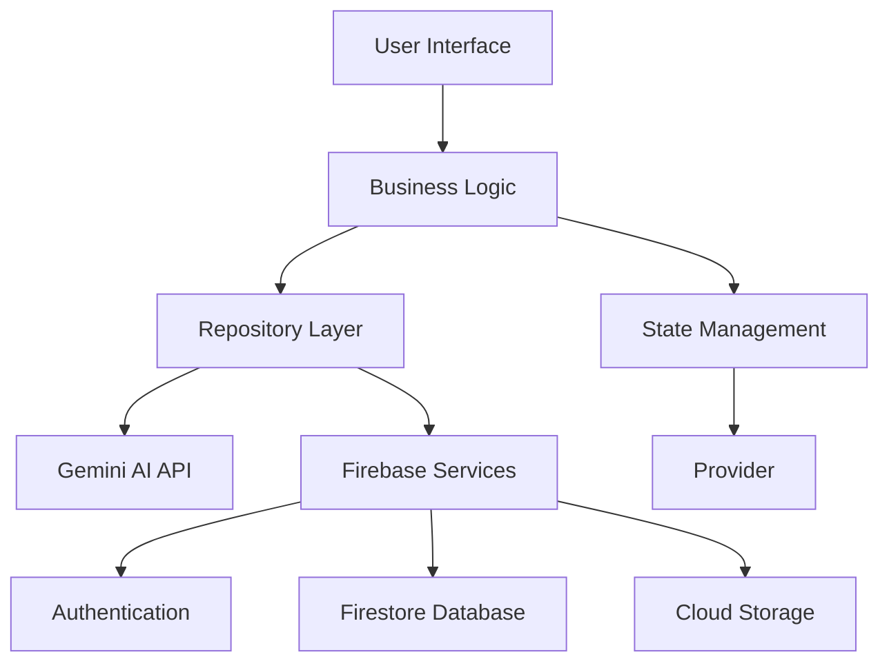

<p align="center">
  
</p>

<h1 align="center">
  
</h1>

<p align="center">
  <a href="https://flutter.dev"></a>
  <a href="https://firebase.google.com"></a>
  <a href="https://ai.google.dev"></a>
</p>

<p align="center">
  <b>One Click, One Solution</b>
</p>

<div align="center">
 
</div>

## ✨ Key Features

<div align="center">
  <table>
    <tr>
      <td align="center" width="25%">
        <br/>
        <b>AI Text Processing</b>
      </td>
      <td align="center" width="25%">
        <br/>
        <b>Image Recognition</b>
      </td>
      <td align="center" width="25%">
        <br/>
        <b>Secure Authentication</b>
      </td>
      <td align="center" width="25%">
        <br/>
        <b>Subscription Plans</b>
      </td>
    </tr>
  </table>
</div>

### 🤖 Text Intelligence

<div align="center">
  <table>
    <tr>
      <td>✏️ Grammar Correction</td>
      <td>🔍 AI Content Detection</td>
      <td>📝 Text Summarization</td>
    </tr>
    <tr>
      <td>🔄 Paraphrasing</td>
      <td>🌍 Language Translation</td>
      <td>😊 Sentiment Analysis</td>
    </tr>
    <tr>
      <td>📊 Keyword Extraction</td>
      <td>📚 Academic Writing</td>
      <td>📰 Blog Generation</td>
    </tr>
    <tr>
      <td>✉️ Email Writing</td>
      <td>💬 Chat Assistant</td>
      <td>📋 Content Optimization</td>
    </tr>
  </table>
</div>

### 📸 Visual Intelligence

<div align="center">
  <table>
    <tr>
      <td>📄 OCR Technology</td>
      <td>🖼️ Image Description</td>
      <td>🔢 Math Problem Solver</td>
    </tr>
    <tr>
      <td>🌐 Visual Translation</td>
      <td>💊 Prescription Reader</td>
      <td>📊 Chart Analysis</td>
    </tr>
    <tr>
      <td>🧾 Document Analysis</td>
      <td>💻 Code Analysis</td>
      <td>🔍 Product Review</td>
    </tr>
    <tr>
      <td>🏠 Property Analysis</td>
      <td>🪪 ID Card Scanner</td>
      <td>🔎 Object Detection</td>
    </tr>
  </table>
</div>

### 🔐 Seamless Security

<div align="center">
  <table>
    <tr>
      <td>🔥 Firebase Authentication</td>
      <td>✉️ Email Verification</td>
      <td>💾 Secure Data Backup</td>
    </tr>
    <tr>
      <td>🔄 Cloud Synchronization</td>
      <td>🔒 Privacy-Focused Design</td>
      <td>🛡️ End-to-End Encryption</td>
    </tr>
  </table>
</div>

## 📱 Screenshots

<div align="center">
  
</div>

<details>
  <summary><b>📷 View More Screenshots</b></summary>
  <div align="center">
    <br>
    
    
    
    
    
    
    
    
    
  </div>
</details>

## 💎 Pricing

<div align="center">
  <table>
    <tr>
      <th>🚀 Free Plan</th>
      <th>⭐ Basic Plan</th>
      <th>💎 Premium Plan</th>
    </tr>
    <tr>
      <td>
        <p align="center"><b>$0.00</b></p>
        <ul>
          <li>Text Generations: 10/day</li>
          <li>Image Processing: 3/day</li>
          <li>Basic Features</li>
          <li>Community Support</li>
        </ul>
        <p align="center"><a href="#"></a></p>
      </td>
      <td>
        <p align="center"><b>$4.99/month</b></p>
        <ul>
          <li>Text Generations: 100/day</li>
          <li>Image Processing: 50/day</li>
          <li>Advanced Features</li>
          <li>Email Support</li>
        </ul>
        <p align="center"><a href="#"></a></p>
      </td>
      <td>
        <p align="center"><b>$9.99/month</b></p>
        <ul>
          <li>Text Generations: Unlimited</li>
          <li>Image Processing: 200/day</li>
          <li>Premium Features</li>
          <li>Priority Support</li>
        </ul>
        <p align="center"><a href="#"></a></p>
      </td>
    </tr>
  </table>
</div>

## 🚀 Installation

<div align="center">
  <a href="https://play.google.com/store/apps"></a>
  <a href="https://apps.apple.com/"></a>
</div>

### Prerequisites

- Flutter 3.3.0 or higher
- Dart SDK 3.0.0 or higher
- Google Cloud API key with Gemini AI enabled
- Firebase project

### Setup Steps

```bash
# Clone this repository
$ git clone https://github.com/Noctambulist007/OneAI.git

# Go into the repository
$ cd oneai

# Install dependencies
$ flutter pub get

# Create .env file for API keys
$ touch .env

# Add your Gemini API key to .env file
# GEMINI_API_KEY=your_api_key_here

# Setup Firebase
$ flutter pub add firebase_core
$ flutter pub add firebase_auth
$ flutter pub add cloud_firestore
$ flutterfire configure

# Run the app
$ flutter run
```

### Configuration

Create a `.env` file in the project root with your API keys:

```
GEMINI_API_KEY=your_gemini_api_key_here
```

## 🛠️ Tech Stack

<div align="center">
  <table>
    <tr>
      <td align="center">
        <br/>
        Flutter
      </td>
      <td align="center">
        <br/>
        Firebase
      </td>
      <td align="center">
        <br/>
        Gemini AI
      </td>
    </tr>
    <tr>
      <td align="center">
        <br/>
        Provider
      </td>
      <td align="center">
        <br/>
        Firestore
      </td>
      <td align="center">
        <br/>
        In-App Purchase
      </td>
    </tr>
  </table>
</div>

## 📊 App Architecture



## 🤝 Contributing

We welcome contributions from the community! Please follow these steps:

1. Fork the repository
2. Create your feature branch (`git checkout -b feature/amazing-feature`)
3. Commit your changes (`git commit -m 'Add some amazing feature'`)
4. Push to the branch (`git push origin feature/amazing-feature`)
5. Open a Pull Request

## 📈 Roadmap

<div align="center">
  <table>
    <tr>
      <th>Q1 2026</th>
      <th>Q2 2027</th>
      <th>Q3 2028</th>
    </tr>
    <tr>
      <td>Voice Assistant Integration</td>
      <td>Multi-language Support</td>
      <td>Advanced Analytics Dashboard</td>
    </tr>
    <tr>
      <td>Custom AI Models</td>
      <td>Desktop Application</td>
      <td>Developer API</td>
    </tr>
    <tr>
      <td>Offline Processing</td>
      <td>Community Features</td>
      <td>Enterprise Solutions</td>
    </tr>
  </table>
</div>

---

<div align="center">
  
  
  <p>
    <sub>Built with ❤️ by <a href="https://github.com/Noctambulist007">Noctambulist007</a></sub>
  </p>
